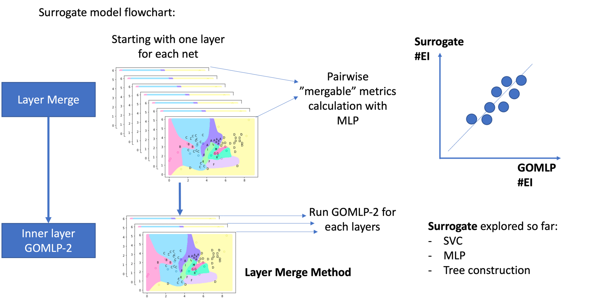
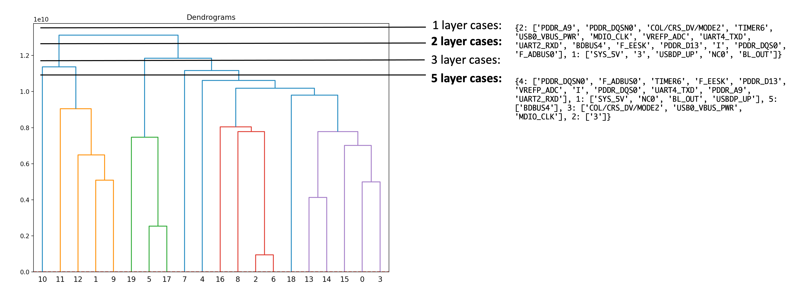

# Multilayer_GOMLP

This project focusing on extending the GOMLP to multilayer cases. The GOMLP (published in DAC 2022) solves 2D power plane generation problem with combination of MLP and evolutionary method, figrue below shows the GOMLP method. 

<p align="center">

</p>


The proposed method for multilayer GOMLP is as follows:

<p align="center">

</p>


## Project strctures: 
```
gomlp
├── MLGO_2_with_plots.py
├── MLGO_2_multilayer.py
├── MLGO_2_multilayer_withHierarchi.py (! manual pending)
├── hierarch_cluster_custom_dist.py
├── tmp
├── color_map.pkl
├── pin_file (e.g. pins_BeagleBone_RevC_human_singleLayer.csv) 
├── results
    ├── #EIs results file (e.g. gomlp_results_50nets.csv)
surrogate
├── surrogate_model_new.py
├── surrogate_model_multilayer.py
├── tmp
├── output.csv (e.g. output_50nets.csv)
├── color_map.pkl
├── pin_file (e.g. pins_BeagleBone_RevC_human_singleLayer.csv) 
utils
├── generate_testcases.py
├── pin_file (e.g. pins_BeagleBone_RevC_human_singleLayer.csv) 
├── output.csv
├── analyze_surrogate_gomlp_corr
```

## Code running instructions: 
#### 1. Running (2D) GOMLP: 
Files needed:
  - pin_file (e.g. pins_BeagleBone_RevC_human.csv _[pin config for all nets and layers])
  - colormap.pkl (optional, will automatically generate if not exists)
Under directory ```gomlp```, specify the problems/gomlp parameters (net name, layer name, etc. in MLGO_2_with_plots.py) and run the following 
```
python MLGO_2_with_plots.py 
```
Problem specifications (to be specified in ```MLGO_2_with_plots.py```): 
- Net list 
- Net list combination of different problems (based on loaded problem files e.g. output.csv) 

Key parameters of GOMLP (in MLGO_2_with_plots.py, class Genetic):
- num_of_generations
- sol_per_pop
- handles/metaball parameters
- weights of loss terms: default settings: {'num_islands': 0.9, 'disjoint_distance': 0.9, 'island_length': 0.30 , 'contour_dtm':0.50}

Output files:
- #EIs for different problems (e.g. gomlp_results_50nets.csv)

Note: 
- GOMLP now generate images as long as score (fit accuracy > 0.5)

For more info, refer to the original repo: https://github.com/vinayp173/GOMLP-2

#### 2. Running surrogate models: 
Surrogate models developed so far: MLP, SVC, MST (in progress)
Files needed:
  - pin_file (e.g. pins_BeagleBone_RevC_human.csv _[pin config for all nets and layers])
  - colormap.pkl (generated by ```MLGO_2_with_plots.py```, need to copy it from directory ```gomlp```)
  - output.csv (e.g. output_50nets.csv, specify the combinations of nets of different problems)
Under directoryy ```surrogate```, speficy surrogate model parameters, and run:
```
python surrogate_model_new.py
```
Specifications and parameters:

#### 3. Running problem generation code: 
The code ```generate_testcases.py``` generate problems with different combinations of nets for a specified set of nets. 
Fiiles needed: 
  - pin_file (e.g. pins_BeagleBone_RevC_human.csv)
Under directory ```utils```, specificy the problem pin files and combination of nets, and run:
 ```
 python generate_testcases.py
 ```
 Key parameters: 
 - number_of_nets: length of netliist that will be used to choose nets when generating random problems
 - number_of_nets_chosen: number of nets for each problems (randomly chosen from the same netlist)
 - number_of_problems: number of problems that need to be generated
The generated problem file is ```output.csv```, which contains the net names and their combinations

#### 4. Running hierarchical clustering:
The code ```gomlp/hierarch_cluster_custom_dist.py``` runs the hierarchical clustering for nets in a design based on surrogate cost. The clustering will be used to decide the net assignment given specific number of #layers budget, as shown in the figure below. 
<p align="center">

</p>

Under directory ```gomlp```, specify the following files in code ```hierarch_cluster_custom_dist.py``` and run the code below
Files to specify: 
- Net combination file (net_combination e.g. ../surrogate/surrogate_cost_2nets_NetComb.npy)
- Surrogate cost file (X, e.g.: ../surrogate/surrogate_cost_2nets_Cost_Haus.npy)
- Results file (output_file e.g.: ayer_assignment.pkl), this file will stores the net clutering (in other words layer assignments in a dictionary format)
 ```
 python hierarch_cluster_custom_dist.py
 ```

#### 5. Analysis code:
The following codes are used for analyzing the results:
- ```analyze_surrogate_gomlp_corr.py```: analyzing the correlation between results (#EIs) from GOMLP and surrogate models (MLP, SVC, etc.)


#### Note:


#### Reference: 
1. GOMLP DAC paper: "AUTOMATIC POWER PLANE GENERATION WITH GENETIC OPTIMIZATION AND MULTILAYER PERCEPTRON"
